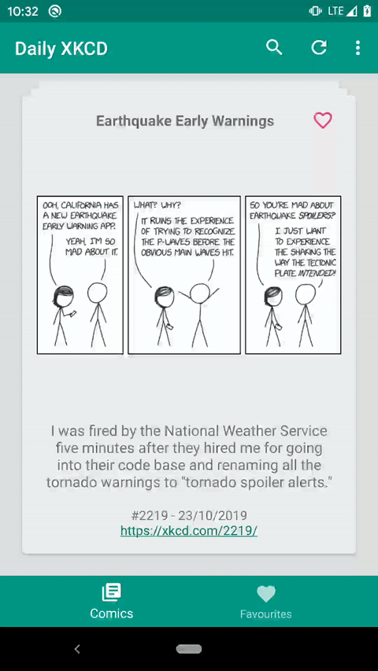
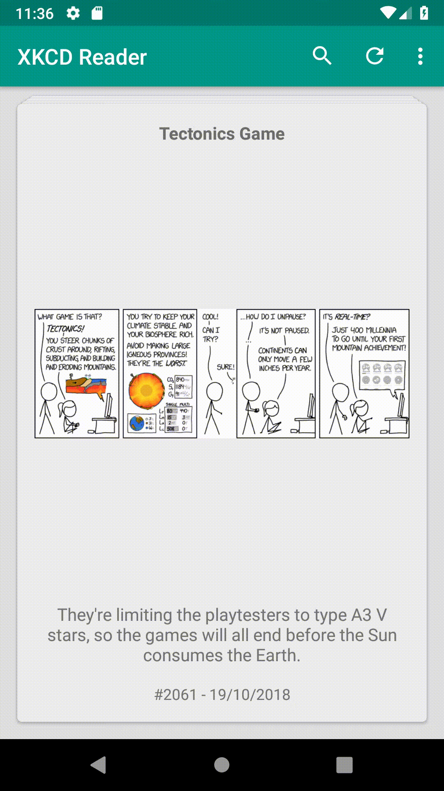
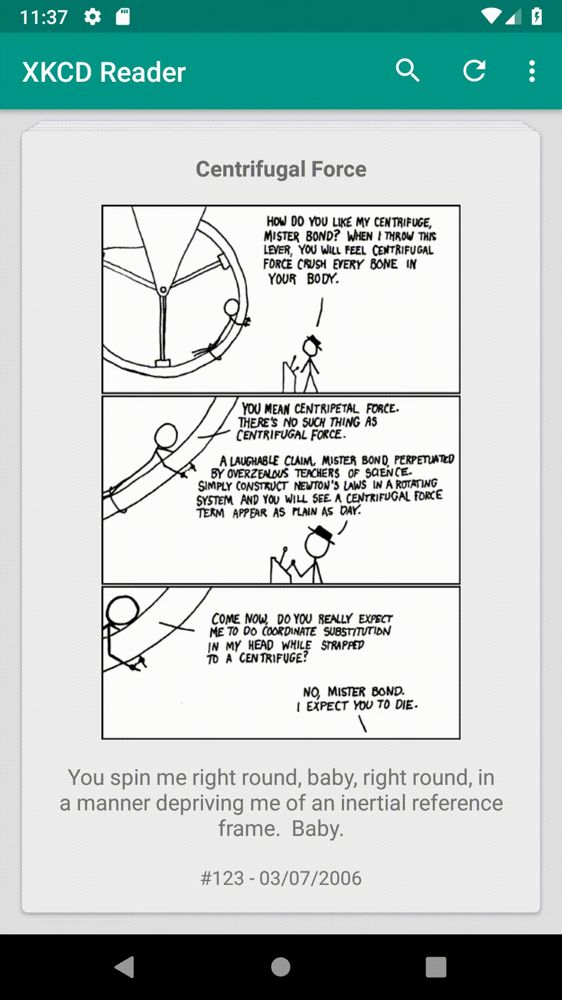

# XKCD Comic Reader (unofficial)
Fan made [XKCD](https://xkcd.com/) comic reader using the official [JSON interface](https://xkcd.com/json.html).

## Media

## Dependencies
* [Kotlin](https://developer.android.com/kotlin/)
* [Android Architecture Components](https://developer.android.com/topic/libraries/architecture/)
* [AndroidX](https://developer.android.com/jetpack/androidx/)
* [RxAndroid](https://github.com/ReactiveX/RxAndroid)
* [Card Stack View](https://github.com/yuyakaido/CardStackView)
* [Dagger 2](https://github.com/google/dagger)
* [Retrofit 2](https://github.com/square/retrofit)
* [Fresco](https://github.com/facebook/fresco)
* [Kotpref](https://github.com/chibatching/Kotpref)
* [Toasty](https://github.com/GrenderG/Toasty)
* [Lovely Dialog](https://github.com/yarolegovich/LovelyDialog)
* [Timber](https://github.com/JakeWharton/timber)
* [ktlint](https://github.com/shyiko/ktlint)

## Disclaimer
I do not own or affiliate myself with [XKCD](https://xkcd.com/), but I love the comic. Hope you enjoy the app as much as I do.

## Releases
The app will not go into Play Store as this is not endorsed and unofficial. Sill, if you want a copy of the reader, head over to the [releases](https://github.com/MikeFot/android--xkcd-reader/releases) page and download an APK.

